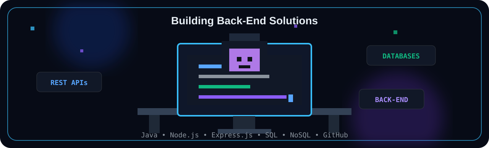
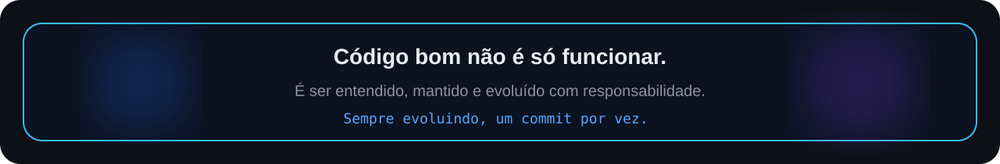

  

<h1 align="center"> 👋 Olá, me chamo 👨🏻‍💻 Gustavo!</h1>

  

---

## 🌐 Conexões

  Conexões profissionais, oportunidades e conversas sobre back-end são bem-vindas.

  

  

  

---

## 💻 Technical Skills:

  
  
  
  
  
  
  
  
  

 

  

---

## 📌 Projeto em destaque

<table>
  <tr>
    <td width="100%">
      <h3>📍 <a href="https://github.com/guscodeworks/Ponto-Escolar">Ponto Escolar</a></h3>
      

        Atualmente desenvolvendo:
        <a href="https://github.com/guscodeworks/Ponto-Escolar"><strong>Ponto Escolar</strong></a>
      

      

        
      

    </td>
  </tr>
</table>

---

  

